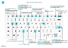

# Raccourcis clavierKeyboard Shortcuts
Cet article fournit un aperçu de certaines combinaisons de touches de raccourcis que vous pouvez utiliser avec lorsque vous utilisez [!INCLUDE[prodshort](includes/prodshort.md)].This article provides an overview of some of the shortcut key combinations that you can use when you are working with [!INCLUDE[prodshort](includes/prodshort.md)].

Pour un aperçu des raccourcis clavier les plus courants, voir [Raccourcis clavier (PC uniquement)](keyboard-shortcuts-cheatsheet.md).For an overview of the most popular keyboard shortcuts, see [Keyboard Shortcuts (PC only)](keyboard-shortcuts-cheatsheet.md).

> [!TIP]
> Pour une vue graphique des raccourcis les plus utilisés, sélectionnez l'image suivante et téléchargez le fichier PDF.For a graphical view of the most used shortcuts, choose the following image and download the PDF file.
>
> 

## AperçuOverview
Les raccourcis clavier facilitent l'accessibilité et la navigation dans différentes zones et éléments d'une page.Keyboard shortcuts aid accessibility and can make it easier and more efficient to navigate to different areas and elements on a page. Ils sont pris en charge par la plupart des navigateurs Web ; toutefois, leur comportement peut varier légèrement.They are supported by most web browsers, however, the behavior may vary slightly.

> [!NOTE]
> Les raccourcis clavier décrits ici font référence au type de clavier en usage aux États-Unis.The keyboard shortcuts described here refer to the U.S. keyboard layout. Il se peut que les touches des autres claviers ne correspondent pas exactement aux touches des claviers en usage aux États-Unis.The layout of the keys on other keyboards may not correspond exactly to the keys on a U.S. keyboard.

La plupart des raccourcis sont les mêmes, que le système d'exploitation soit Windows ou macOS.Most of the shortcuts are the same whether the operating system is Windows or macOS. Cependant, certains raccourcis diffèrent pour macOS.However, some shortcuts differ for macOS. Ils sont indiqués entre parenthèses dans les sections suivantes.These are indicated with brackets in the following sections.

> [!NOTE]
> Outre les raccourcis clavier globaux décrits dans cette rubrique, un certain nombre de raccourcis spécifiques à votre activité sont disponibles.In addition to the global keyboard shortcuts described in this topic, a number of business-specific shortcuts are available. Par exemple, dans la version générique de [!INCLUDE[prodshort](includes/prodshort.md)], F9 enregistre un document et Ctrl+F7 affiche les écritures financières d’un enregistrement.For example, in the generic version of [!INCLUDE[prodshort](includes/prodshort.md)], F9 posts a document and Ctrl+F7 shows the financial entries for a record. (Celles-ci peuvent être différentes dans votre solution.) Le raccourci clavier est affiché dans l'info-bulle de l'action en question.(These may be different in you solution.) The keyboard shortcut is shown in the tooltip for the action in question.

##   Raccourcis clavier générauxGeneral Keyboard Shortcuts
Le tableau suivant décrit les raccourcis clavier pour naviguer et accéder à différents éléments d'une page, tels que des actions, des listes déroulantes, des recherches, etc.The following table describes keyboard shortcuts for navigating and accessing different elements of a page, such as actions, drop-down lists, lookups, and more. Pour en savoir plus sur les raccourcis clavier pour naviguer entre les enregistrements au sein d'une la liste, consultez la prochaine section.For details about keyboard shortcuts for navigating records once you get inside a list, see the next section.

|Appuyez sur les touches suivantesPress these keys (dans macOS)(in macOS)|PourTo do this|
|----------------|-----------|
|Alt+Flèche basAlt+Down Arrow|Ouvrir une liste déroulante ou rechercher la valeur d'un champ.Open a drop-down list or look up a value for a field.|    
|Alt+Flèche vers le hautAlt+Up Arrow|Afficher l'info-bulle pour un champ ou un en-tête de colonne d'une table.Show tooltip for a field or a column header of a table. Si le champ a des erreurs de validation, appuyez sur « Alt+Flèche vers le haut » pour afficher l'erreur de validation.If the field has validation errors, press Alt+Up Arrow to show the validation error. Appuyez sur « Échap » ou « Alt+Flèche vers le haut » pour fermer l'info-bulle.Press Esc or Alt+Up Arrow to close the tooltip.|
|Alt+F2Alt+F2|Affichez et masquez le volet Récapitulatif.Show and hide the FactBox pane.|
|Alt+Maj+F2Alt+Shift+F2|Basculer entre **Détails** et **Pièces jointes** dans le volet Récapitulatif.Shift between **Details** and **Attachments** in the FactBox pane.|
|Alt+OAlt+O|Ajouter une nouvelle note pour l'enregistrement sélectionné, même si le volet Récapitulatif n'est pas ouvert.Add a new note for the selected record, even if the FactBox pane is not open.|
|Alt+QAlt+Q (Ctrl+Option+Q)(Ctrl+Option+Q)|Ouvrir la fenêtre **Tell Me**.Open the **Tell Me** window. Pour plus d'informations, voir [Recherche de pages et d'informations avec Tell Me](ui-search.md).For more information, see [Finding Pages and Information with Tell Me](ui-search.md).|
|Alt+NAlt+N |Ouvrir une page pour créer un nouvel enregistrement.Open a page to create a new record. (Semblable au choix des actions **Nouveau** et **+**.)(Similar to choosing the **New** and **+** actions.)|
|Alt+Maj+NAlt+Shift+N |Fermer une page nouvellement créée et en ouvrir une nouvelle pour créer un enregistrement.Close a newly created page and open a new one to create a new record. De même, Alt + F9 valide un document et en crée un nouveau.Similarly, Alt+F9 posts a document and creates a new one.|
|Alt+TAlt+T|Ouvrez la page **Mes paramètres**.Open the **My Settings** page.|
|Alt+Flèche vers la droiteAlt+Right Arrow|Rechercher des informations supplémentaires ou des valeurs sous-jacentes pour un champ contenant le bouton .Look up additional information or underlying values for a field that contains the  button. Ceci est utilisé lorsque le bouton déroulant habituel (Alt + Flèche vers le bas) dans le même champ est utilisé à une autre fin.This is used when the usual drop-down button (Alt+Down Arrow) in the same field is used for another purpose.|
|Shift+F12Shift+F12|Ouvrir l'explorateur de rôles, une vue d'ensemble des fonctionnalités.Open the role explorer, a feature overview. Pour plus d'informations, voir [Recherche de pages avec l'explorateur de rôles ](ui-role-explorer.md).For more information, see [Finding Pages with the Role Explorer](ui-role-explorer.md).|
|Ctrl+Alt+Maj+CCtrl+Alt+Shift+C|Afficher des informations dans le badge compagnie.Display information in the company badge.|
|Ctrl+Alt+F1Ctrl+Alt+F1|Ouvrez, puis fermez le volet d'inspection des pages.Open and close the page inspection pane. Ce dernier affiche les informations relatives à la page, comme sa table source, ses champs, ses filtres, ses extensions, etc.The page inspection pane shows information about the page, like its source table, fields, filters, extensions, and more.  Pour plus d'informations, reportez-vous à la rubrique [Inspection des pages](across-inspect-page.md).For more information, see [Inspecting Pages](across-inspect-page.md).|
|Ctrl+CCtrl+C |Copiez la valeur du champ.Copy the value of field. Si le champ a le focus, et si vous n'avez pas sélectionné un texte dans le champ, l'intégralité de la valeur est copiée.If the field is in focus, and you have not selected any text in the field, this will copy the entire value. Si vous avez sélectionné un texte dans le champ, seul le texte sélectionné est copié.If you have selected any text in the field, then it will copy the selected text only.|
|Ctrl+F1Ctrl+F1|Ouvrez l'aide de Business Central pour la page.Open the Business Central help for the page.|
|Ctrl+F12Ctrl+F12|Passez de la vue de mise en page développée à la vue de mise en page réduite.Switch between wide and narrow layout view.|
|Ctrl+ClicCtrl+Click|Naviguer pendant la personnalisation lorsque l'action est mise en surbrillance avec une flèche.Navigate during personalizing or customizing when the action is highlighted with an arrowhead. Pour plus d'informations, voir [Personnaliser votre espace de travail](ui-personalization-user.md).For more information, see [Personalize Your Workspace](ui-personalization-user.md).|  
|Ctrl+F5Ctrl+F5|Rechargez l'application [!INCLUDE[prodshort](includes/prodshort.md)].Reload the [!INCLUDE[prodshort](includes/prodshort.md)] application. (Similaire à sélectionner l'actualisation/rechargement du navigateur.)(Similar to selecting refresh/reload in the browser.)|
|F5F5|Actualiser les données sur la page actuelle.Refresh the data on the current page.  Utilisez cette fonction pour vous assurer que les données sont à jour sur la page avec les modifications que d'autres ont effectués pendant que vous travaillez.Use this to ensure that the data on the page is up-to-date with any changes that others have made while you are working.|
|SaisissezEnter|Activer ou accéder à l'élément ou au contrôle qui a le focus.Enable or access the element or control that is in focus.|
|EchapEsc|Fermer la page actuelle ou la liste déroulante.Close the current page or drop-down list.|
|TabTab|Déplacer le focus sur le contrôle ou l'élément suivant d'une page, par exemple les actions, les boutons, les champs ou les en-têtes d'une liste.Move focus to the next control or element on a page, such as actions, buttons, fields, or list headings.|
|MAJ+TabShift+Tab|Déplacer le focus sur le contrôle ou l'élément précédent d'une page, par exemple les actions, les boutons, les champs ou les en-têtes d'une liste.Move focus to the previous control or element on a page, such as actions, buttons, fields, or list headings.|

## Raccourcis clavier dans les listesKeyboard Shortcuts in Lists

Le tableau suivant décrit les raccourcis clavier que vous pouvez utiliser dans une page de liste.The following table describes the keyboard shortcuts that you can use on a list page. L'action de raccourci est légèrement différente selon que la page est affichée dans la vue de liste ou la vue en mosaïque.The shortcut action is slightly different depending on whether the page is shown in the list view or tile view.
<!--
> [!Note]
> In the table that follows, the term *actionable field* refers to a field on which you can do something, like change a value or link to another page. In general, the shortcuts will skip over fields that display information that you cannot change from the list (in other words, fields that are read-only).
-->
### GénéralGeneral

|Appuyez sur les touches suivantesPress these keys (dans macOS)(in macOS)|Pour procéder dans une vue de listeTo do this in a list view|Pour procéder dans une vue en mosaïqueTo do this in a tile view |
|-----------------|-------|-------|
|Alt+F7Alt+F7 |Triez la colonne sélectionnée dans l'ordre croissant ou décroissant.Sort the selected column in ascending or descending order.|Non applicable.Not applicable.|
|Alt+NAlt+N|Insérer une nouvelle ligne dans une liste modifiable, telle que la page **Budgets GL**.Insert a new line in an editable list, such as the **G/L Budgets** page.|Identique.Same.|
|Shift+F10Shift+F10 |Ouvrir un menu d'options disponibles pour la ligne sélectionnée.Open a menu of options that are available for the selected row.|Identique.Same.|

### Navigation entre les lignes et les colonnesNavigating Between Rows and Columns

|Appuyez sur les touches suivantesPress these keys (dans macOS)(in macOS)|Pour procéder dans une vue de listeTo do this in a list view |Pour procéder dans une vue en mosaïqueTo do this in a tile view |
|-----------------|-------|-------|
|Ctrl+DébutCtrl+Home (Fn+Ctrl+Flèche gauche)(Fn+Ctrl+Left Arrow)|Sélectionnez la première ligne dans la liste ; le focus reste dans la même colonne.Select the first row in the list; focus remains in the same column.|Accéder à la première vignette de la première ligne.Move to the first tile in the first row. |
|Ctrl+FinCtrl+End (Fn+Ctrl+Flèche droite)(Fn+Ctrl+Right Arrow)|Sélectionnez la dernière ligne dans la liste ; le focus reste dans la même colonne.Select the last row in the list; focus remains in the same column.|Accéder à la dernière vignette de la dernière ligne.Move to the last tile in the last row.|
|ParticulierHome (Fn+flèche gauche)(Fn+Left Arrow)|Accéder au premier champ de la ligne.Move to the first field in the row.|Accéder à la première vignette de la ligne.Move to the first tile in the row.|
|FinEnd (Fn+flèche droite)(Fn+right Arrow)|Accéder au dernier champ de la ligne.Move to the last field in the row.|Accéder à la dernière vignette de la ligne.Move to the last tile in the row.|
|SaisissezEnter|Ouvrez l'enregistrement associé à ce champ.Open the record that is associated with the field.  Approprié uniquement si une page Fiche est associée à l'enregistrement.Only relevant if a card page is associated with the record.|Ouvre l'enregistrement.Opens the record.  Approprié uniquement si une page Fiche est associée à l'enregistrement.Only relevant if a card page is associated with the record.|
|Ctrl+EnterCtrl+Enter|Déplacer le focus sur l'élément suivant en dehors de la liste.Move focus to the next element outside the list.|Déplacez le focus sur l'élément suivant en dehors de la liste.Move focus to the next element outside the list.|
|Flèche basDown Arrow|Accédez au champ de la ligne du dessous au sein de la même colonneMove in the same column to the field in the row below. |Accédez au champ de la vignette du dessous au sein de la même colonneMove in the same column to the tile in the row below. |
|Flèche vers le hautUp Arrow|Accédez au champ de la ligne du dessus au sein de la même colonneMove in the same column to the field in the row above.| Accédez au champ de la vignette du dessus au sein de la même colonneMove in the same column to the tile in the row above.  |
|Flèche vers la droiteRight Arrow|Dans une liste en lecture seule, accédez au prochain champ à droite de la même ligne.In a view-only list, move in the same row to the next field to the right.  Dans une liste modifiable, allez à droite dans le champ actuel.In an editable list, move to the right within the current field.| Accédez à la prochaine vignette à droite de la même ligne.Move in the same row to the next tile to the right. |
|Flèche vers la gaucheLeft Arrow|Dans une liste en lecture seule, accédez au champ précédent à gauche de la même ligne.In a view-only list, move in the same row to the previous field to the left.   Dans une liste modifiable, allez à gauche dans le champ actuel.In an editable list, move to the left within the current field.| Accédez à la vignette précédente à gauche de la même ligne.Move in the same row to the previous tile to the left. |
|Page précédentePage Up (Fn + Flèche haut)(Fn+up Arrow)|Faites défiler pour afficher l'ensemble de lignes au-dessus des lignes actuelles de la vue.Scroll to display the set rows above the current rows in view. |Fait défiler pour afficher l'ensemble de vignettes au-dessus des vignettes actuelles de la vue.Scrolls to display the set of tiles above the current tiles in view. |
|Page suivantePage Down (Fn + Flèche bas)(Fn+down Arrow)|Faites défiler pour afficher l'ensemble de lignes sous des lignes actuelles de la vue.Scroll to display the set rows below the current rows in view.|Faites défiler pour afficher l'ensemble de vignettes sous des vignettes actuelles de la vue.Scroll to display the set of tiles below the current tiles in view.|
|TabTab|Dans une liste modifiable, accédez au prochain champ à droite de la même ligne.In editable list, move in the same row to the next field to the right.|Non applicable.Not applicable.||
|MAJ+TabShift+Tab|Dans une liste modifiable, accédez au champ suivant à gauche de la même ligne.In editable list, move in the same row to the previous field to the left. | Non applicable.Not applicable. |

### Sélection, copie et collageSelecting, Copying, and Pasting

|Appuyez sur les touches suivantesPress these keys (dans macOS)(in macOS)|Pour procéder dans une vue de listeTo do this in a list view |Pour procéder dans une vue en mosaïqueTo do this in a tile view |
|-----------------|-------|-------|
|Ctrl+ClicCtrl+Click (Cmd+Clic)(Cmd+Click)|Étendez la sélection des lignes pour inclure la ligne sur laquelle vous souhaitez cliquer.Extend the selection of rows to include the row that you click.|Non applicable.Not applicable.|
|Maj+clicShift+Click|Étendez la sélection des lignes pour inclure la ligne sur laquelle vous souhaitez cliquer et toutes les lignes entre les deux.Extend the selection of rows to include the row that you click and all the rows in between.  Vous pouvez utiliser cette action à l'aide de Ctrl+flèche haut ou Ctrl+flèche bas pour développer votre sélection.You can use this after using Ctrl+Up Arrow or Ctrl+Up Down to expand your selection.|Non applicable.Not applicable.|
|Ctrl+Flèche hautCtrl+Up Arrow (Ctrl+Cmd+Flèche haut)(Ctrl+Cmd+Up Arrow)|Déplacez le focus sur la ligne précédente et conservez la ligne actuelle sélectionnée.Move focus to the row above and keep the current row selected.|Non applicable.Not applicable.|
|Ctrl+Flèche basCtrl+Down Arrow (Ctrl+Cmd+Flèche bas)(Ctrl+Cmd+Down Arrow)|Déplacez le focus sur la ligne suivante et conservez la ligne actuelle sélectionnée.Move focus to the row below and keep the current row selected.|Non applicable.Not applicable.|
|Ctrl+Barre d'espaceCtrl+Space Bar (Ctrl+Cmd+Barre d'espace)(Ctrl+Cmd+Space )|Étendez la sélection des lignes pour inclure la ligne active.Extend the selection of rows to include the focused row.  Vous pouvez utiliser cette action à l'aide de Ctrl+flèche haut ou Ctrl+flèche bas pour développer votre sélection.You can use this after using Ctrl+Up Arrow or Ctrl+Down Arrow to expand your selection.|Non applicable.Not applicable.|
|Ctrl+ACtrl+A|Sélectionner toutes les lignes.Select all rows.|Non applicable.Not applicable.|
|Ctrl+CCtrl+C (Cmd+C)(Cmd+C)|Permet de copier les lignes sélectionnées dans le Presse-papiers.Copy the selected rows to the Clipboard.|Oui, mais seulement pour une seule vignette sélectionnée.Yes, but only for a single selected tile.|
|Ctrl+VCtrl+V (Cmd+V)(Cmd+V)|Collez les lignes sélectionnées du Presse-papiers dans la page actuelle ou le document externe, comme Microsoft Excel ou un courriel Outlook.Paste the selected rows from the Clipboard into the current page or external document, like Microsoft Excel or Outlook email. Vous pouvez effectuer ces opérations uniquement dans les listes modifiables.You can only do this in editable lists.|Non applicable.Not applicable.|
|Maj+Flèche hautShift+Up Arrow|Étendez la sélection des lignes pour inclure la ligne précédente.Extend the selection of rows to include the row above.|Non applicable.Not applicable.|
|Maj+Flèche basShift+Down Arrow|Étendez la sélection des lignes pour inclure la ligne suivante.Extend the selection of rows to include the row below.|Non applicable.Not applicable.|
|Maj+HautShift+Page Up (Maj+Fn+Flèche haut)(Shift+Fn+Up Arrow)|Étendez la sélection des lignes pour inclure toutes les lignes visibles au-dessus de la sélection actuelle des lignes.Extend the selection of rows to include all visible rows above the current selection of rows.|Non applicable.Not applicable.|
|Maj+BasShift+Page Down (Maj+Fn+Flèche bas)(Shift+Fn+Down Arrow)|Étendez la sélection des lignes pour inclure toutes les lignes visibles au-dessous de la sélection actuelle des lignes.Extend the selection of rows to include all visible rows below the current selection of rows.|Non applicable.Not applicable.|
|F8F8|Copier le champ dans la même colonne de la ligne précédente, et le coller dans la ligne actuelle.Copy the field in the same column of the row above, and paste it into the current row. Vous pouvez effectuer ces opérations uniquement dans les listes modifiables.You can only do this in editable lists. L'utilisation de ce raccourci suivi d'une tabulation vous permet de renseigner rapidement les champs dans les lignes articles que vous souhaitez avoir la même valeur que la ligne précédente.Using this shortcut followed by a Tab lets you quickly fill out fields in line items that you want to have the same value as the row above.|Non applicable.Not applicable.|

### Recherche et filtrage de listesSearching and Filtering Lists

|Appuyez sur les touches suivantesPress these keys (dans macOS)(in macOS)|PourTo do this|
|-----------------|-------|
|F3F3|Bascule la zone Rechercher.Toggles the search box.<ul><li>Activez la zone Rechercher pour que vous puissiez commencer à saisir votre texte de recherche.Activate the search box, so you can start typing your search text.</li><li>Si la zone Rechercher est déjà activée, F3 revient à la liste sans effacer le texte de recherche.If the search box is already activated, F3 returns to the list without clearing the search text.</li><ul>|
|Shift+F3Shift+F3|Ouvrez et refermez le volet Filtre.Open and close the filter pane.<ul><li> Si le volet Filtre n'est pas ouvert, Shift+F3 l'ouvre et s'axe sur l'action **+ Filtre** sous **Filtrer la liste par**, qui vous permet d'appuyer simplement sur Entrée pour commencer à ajouter un filtre champ.If the filter pane is not open, Shift+F3 opens it and focuses on the **+ Filter** action under **Filter list by**, which lets you just hit Enter to start adding a field filter.</li><li>Si le volet Filtre est déjà ouvert, Shift+F3 le ferme mais n'efface pas les filtres que vous avez ajoutés.If the filter pane is already open, Shift+F3 closes it but does not clear any filters that you have added.</li></ul>|
|Ctrl+Shift+F3Ctrl+Shift+F3|Ouvrez et refermez le volet Filtre.Open and close the filter pane.<ul><li> Si le volet Filtre n'est pas ouvert, Ctrl+Shift+F3 l'ouvre et s'axe sur l'action **+ Filtre** sous **Filtrer le total par**, qui vous permet d'appuyer simplement sur Entrée pour commencer à ajouter un filtre totaux.If the filter pane is not open, Ctrl+Shift+F3 opens it and focuses on the **+ Filter** action under **Filter total by**, which lets you just hit Enter to start adding a totals filter.</li><li>Si le volet Filtre est déjà ouvert, Ctrl+Shift+F3 le ferme mais n'efface pas les filtres que vous avez ajoutés.If the filter pane is already open, Ctrl+Shift+F3 closes it but does not clear any filters that you have added.</li></ul>  |
|Alt+F3Alt+F3|Basculez le filtrage vers la valeur sélectionnée.Toggle filtering to the selected value.<ul><li>Applique un filtre de colonne sur la valeur sélectionnée dans la liste.Applies a column filter on the selected field value in the list. Cela correspond à choisir **Filtrer sur cette valeur** d'un en-tête de colonne.This does the same as choosing **Filter to this value** from a column heading. Il ouvre le volet Filtre, définit le filtre sur la valeur sélectionnée, tout en gardant le focus sur la cellule dans la liste.It opens the filter pane, sets filter to the selected value, while focus remains on cell in the list.</li><li>Si la colonne est déjà filtrée, Alt+F3 efface le filtre de cette colonne.If the column is already filtered, Alt+F3 clears the filter on that column.</li></ul> |
|Maj+Alt+F3Shift+Alt+F3|Ouvrez le volet Filtre et ajoutez un filtre sur la colonne sélectionnée dans la liste.Open the filter pane and add a filter on the selected column in the list. Le focus est sur le nouveau champ filtre ce qui permet de commencer à saisir les critères de filtre immédiatement.Focus is on the new filter field which lets start typing the filter criteria right away.   Cela correspond à sélectionner **Filtrer** de l'en-tête de colonne.This does the same as selecting **Filter** from the column heading.  S'il existe déjà un filtre sur le champ, un nouveau filtre est ajouté.If there is already a filter on the field, a new filter is added. |
|Ctrl+Shift+Alt+F3Ctrl+Shift+Alt+F3|Réinitialisez les filtres.Reset filters. Cela correspond à choisir **Réinitialiser les filtres** dans le volet Filtre, et s'applique aux champs et aux filtres de totaux.This does the same as choosing **Reset filters** in the filter pane, and it applies to field and totals filters.   Les filtres reviennent aux filtres par défaut de la fenêtre actuelle.Filters return to the default filters for the current view. Si la fenêtre actuelle est définie sur**Tous**, il s'agit de l'équivalent à revenir à une vue non filtrée avec tous les enregistrements.If the current view is **All**, then this is the same as returning to an unfiltered view with all records. |
|Ctrl+EnterCtrl+Enter|Modifiez le focus depuis le volet de filtrage pour revenir à la liste.Change focus from the filter pane back to the list.|

## Raccourcis clavier des fiches et documentsKeyboard Shortcuts in Cards and Documents

Les raccourcis suivants sont disponibles sur les pages Fiche, telles que **Fiche client** et les pages de document, telles que **Document de vente** pour visualiser et modifier les enregistrements.The following shortcuts are available on card pages, such as **Customer Card**, and document pages, such as **Sales Order**, to display and modify records.

|Appuyez sur les touches suivantesPress these keys (dans macOS)(in macOS)|PourTo do this|
|----------------|-----------|
|Alt+F6Alt+F6|Basculer entre réduire ou développer pour le raccourci actuel.Toggle collapse/expand for the current FastTab.|
|Alt+NAlt+N |Ouvrir une page pour créer un nouvel enregistrement ; de la même façon qu'en sélectionnant l'action **Nouveau**.Open a page to create a new record; the same way as choosing the **New** action. |
|Alt+Maj+NAlt+Shift+N |Fermer une page et en ouvrir une nouvelle pour créer un enregistrement, de la même façon qu'en sélectionnant l'action **OK & Nouveau**.Close a page and open a new one to create a new record; the same way as selecting the **OK & New** action. |
|Alt+Maj+WAlt+Shift+W |Ouvrir la fiche ou le document en cours dans une nouvelle fenêtre.Open the current card or document in a new window. Pour plus d'informations, voir [Multitâche sur plusieurs pages ](ui-enter-data.md#multitasking-across-multiple-pages).For more information, see [Multitasking Across Multiple Pages](ui-enter-data.md#multitasking-across-multiple-pages).|
|Ctrl+Flèche basCtrl+Down Arrow|Ouvrez le nouvel enregistrement pour une entité.Open the next record for an entity.|
|Ctrl+Flèche hautCtrl+Up Arrow |Ouvrez le précédent enregistrement pour une entité.Open the previous record for an entity.|
|Ctrl+InserCtrl+Insert |Insérer une nouvelle ligne sur des documents.Insert a new line in documents.|
|Ctrl+SupprCtrl+Delete |Supprimer la ligne sur des documents, des journaux ou des feuilles de calcul.Delete the line, in documents, journals, and worksheets.|
|Ctrl+Shift+F12Ctrl+Shift+F12 |Maximiser la partie des éléments de ligne sur une page de document.Maximize the line items part on a document page. Appuyez à nouveau sur les touches pour revenir à l'écran normal.Press the keys again to return to the normal display. Pour en savoir plus, reportez-vous à la rubrique [Concentration sur les articles de ligne](ui-enter-data.md#Focus).For more information, see [Focusing on Line Items](ui-enter-data.md#Focus).|
|F6F6|Accéder au raccourci ou à l'élément suivant (sous-page).Move to the next FastTab or part (sub-page).|
|Shift+F6Shift+F6|Accédez au raccourci ou à l'élément précédent (sous-page).Move to previous FastTab or part (sub-page).|

## Raccourcis rapides d'écriture pour les champsQuick Entry Shortcuts for Fields

Les raccourcis suivants se rapportent à la fonction de saisie rapide sur les cartes, documents et pages de liste.The following shortcuts pertain to the Quick Entry feature on cards, documents, and list pages. Sur les listes, les raccourcis ne peuvent pas être utilisés lorsque les listes sont dans la vue en mosaïque.On lists, the shortcuts cannot be used when the list is in the tile view. Pour plus d'informations sur la saisie rapide, reportez-vous à la rubrique [Accélérer la saisie de données à l'aide de la fonction Saisie rapide](ui-enter-data.md#QuickEntry).For more information about Quick Entry, see [Accelerating Data Entry Using Quick Entry](ui-enter-data.md#QuickEntry).

|Appuyez sur les touches suivantesPress these keys (dans macOS)(in macOS)|PourTo do this|RemarquesRemarks|
|-----------------|-------|-------|
|SaisissezEnter|Confirmez la valeur dans le champ actuel et accédez au champ suivant de saisie rapide.Confirm the value in the current field and go to the next Quick Entry field.||
|Maj+EntréeShift+Enter|Confirmez la valeur dans le champ actuel et accédez au champ précédent de saisie rapide.Confirm the value in the current field and go to the previous Quick Entry field.||
|Ctrl+Maj+EntréeCtrl+Shift+Enter|Confirmez la valeur dans la colonne actuelle et accédez au champ suivant de saisie rapide en dehors de la liste.Confirm the value in the current column and go to next Quick Entry field outside the list.  Ce raccourci s'applique aux listes intégrées d'une page, comme les articles de ligne d'un document de vente.This shortcut applies to embedded lists on a page, such as line items on a sales order. Il vous permet de sortir rapidement de la liste et de poursuivre la saisie des données dans d'autres champs de la page.It enables you to quickly get out of the list and continue entering data in other fields on the page.|

## <a name="calendarshortcuts"/> Raccourcis clavier du calendrier (sélecteur de date)<a name="calendarshortcuts"/> Keyboard Shortcuts in the Calendar (Date Picker)

Lorsque vous définissez un champ de date, vous pouvez saisir la date manuellement ou ouvrir un calendrier (sélecteur de date) qui vous permet de sélectionner la date souhaitée.When setting a date field, you can either enter the date manually or open a calendar (date picker) that lets you select the date you want. Le tableau suivant décrit les raccourcis clavier du calendrier.The following table describes the keyboard shortcuts for the calendar.

|Appuyez sur les touches suivantesPress these keys (dans macOS)(in macOS)|PourTo do this|
|-----------------|-------|
|Ctrl+DébutCtrl+Home|Ouvrir le calendrier s'il est fermé.Open the calendar if closed. **Remarque** : Cela ne fonctionne pas si le champ de date est dans une grille, où Ctrl+Début passe à la première ligne.**Note**: This does not work if the date field is in a grid, where Ctrl+Home jumps to the first row.|
|Ctrl+DébutCtrl+Home (Cmd+Accueil)(Cmd+Home)|Accéder au mois actuel, le jour actuel.Move to the current month, current day.|
|Ctrl+Flèche gaucheCtrl+Left Arrow (Cmd+Flèche gauche)(Cmd+Left Arrow)|Accéder au jour précédent.Move to the previous day.|
|Ctrl+Flèche droiteCtrl+Right Arrow (Cmd+Flèche droite)(Cmd+Right Arrow)|Accéder au jour suivant.Move to the next day.|
|Ctrl+Flèche hautCtrl+Up Arrow (Cmd+Flèche haut)(Cmd+Up Arrow)|Accéder à la semaine précédente, le même jour de la semaine.Move to the previous week, same day of the week.|
|Ctrl+Flèche basCtrl+Down Arrow (Cmd+Flèche bas)(Cmd+Down Arrow)|Accéder à la semaine suivante, le même jour de la semaine.Move to the next week, same day of the week.|
|EntréeEnter|Sélectionner la date active.Select the focused date.|
|Ctrl+FinCtrl+End (Cmd+Fin)(Cmd+End)|Fermer le calendrier et supprimer la date actuelle.Close the calendar and delete current the date.|
|ÉchapEsc|Fermer le calendrier sans sélection, conserver la date actuelle.Close the calendar without a selection, keep current date.|
|Page suivantePage Down|Accéder au mois suivant.Move to the next month.|
|Page précédentePage Up|Accéder au mois précédent.Move to the previous month.|  

## Raccourcis clavier dans les champs de dateKeyboard Shortcuts in Date Fields
|Appuyez sur les touches suivantesPress these keys (dans macOS)(in macOS)|PourTo do this|
|-----------------|-------|
|at|Entrez la date actuelle.Enter the current date. « T » signifie « today » (aujourd'hui)."T" stands for "today".|
|tw|Entrez la date de travail.Enter the work date. Pour plus d'informations, voir [Date du flux](ui-change-basic-settings.md#work-date)For more information, see [Work Date](ui-change-basic-settings.md#work-date)|

## <a name="reportpreviewshortcuts"/>Raccourcis clavier dans l'aperçu de rapports<a name="reportpreviewshortcuts"/>Keyboard Shortcuts in the Report Preview

|Appuyez sur les touches suivantesPress these keys (dans macOS)(in macOS)|PourTo do this|
|-----------------|-------|
|Flèche basDown Arrow|Faites défiler vers le bas de la page.Scroll down the page.|  
|Flèche vers le hautUp Arrow|Faites défiler vers le haut de la page.Scroll up the page.|
|Ctrl+0 (zéro)Ctrl+0 (zero) (Cmd+0)(Cmd+0)|Adapte la page entière à la page.Fits the entire page on the page. |
|Ctrl+DébutCtrl+Home (Cmd+Accueil)(Cmd+Home)|Accédez à la première page du rapport.Go to the first page of the report.|
|Ctrl+FinCtrl+End (Cmd+Accueil)(Cmd+Home)|Accédez à la dernière page du rapport.Go to the last page of the report.|
|Flèche vers la gaucheLeft Arrow|Faites défiler vers la gauche lorsque le zoom est appliqué à la page et qu'elle n'est pas entièrement visible.Scroll to the left when the page is zoomed in so that it is not entirely in view. |
|Flèche vers la droiteRight Arrow|Faites défiler vers la droite lorsque le zoom est appliqué à la page et qu'elle n'est pas entièrement visible.Scroll to the right when the page is zoomed in so that it is not entirely in view. |
|Page suivantePage Down (Fn + Flèche bas)(Fn+Down Arrow)|Accédez à la page suivante du rapport.Go to the next page of the report.|
|Page précédentePage Up (Fn + flèche haut)(Fn+Up Arrow)|Accédez à la page précédente du rapport.Go to the previous page of the report.|

## Voir aussiSee also
[Référence rapide de raccourcis clavier - PC uniquementKeyboard Quick Reference - PC Only](keyboard-shortcuts-cheatsheet.md)  
[Fonctionnalités d'assistanceAssistive Features](ui-accessibility.md)  
[Mise en routeGetting Started](product-get-started.md)  
[Utilisation de [!INCLUDE[d365fin](includes/d365fin_md.md)]](ui-work-product.md)[Working with [!INCLUDE[d365fin](includes/d365fin_md.md)]](ui-work-product.md)  
[Forum Aux QuestionsFrequently Asked Questions](across-faq.md)  
